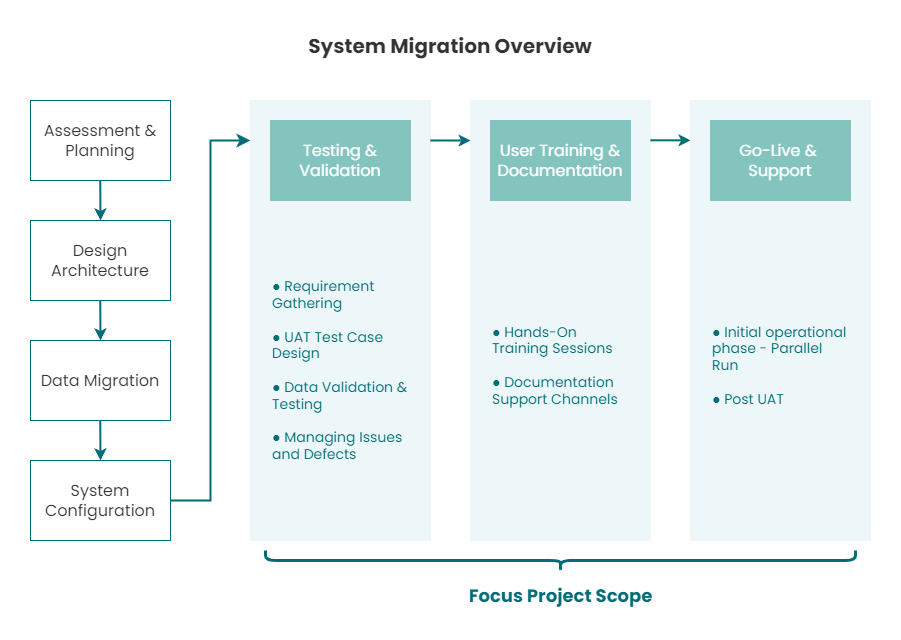
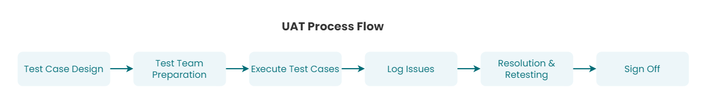

# Case Study: Global Financial System Migration - UAT

🔎 **Refer project details at [here](project-global-financial-system-migration.md).**

## Overview:
   - Global financial system migration project for a **Fortune 500 client in FMCG sector**.
   - Transition from legacy **Hyperion Financial Management (HFM) to OneStream XF.**
   - As Lead F&A and focal point for the Consulting team on the project included:
     - Directly **managed and led User Acceptance Testing (UAT)** efforts for **5 key countries in the APAC region**, verifying that financial data in **OneStream reconciled with SAP**.
     - **Scope:** 80+ critical financial reports, impacting operations across the organization
     - **Duration:** Approximately 2.5 months (Aug 2021 to Nov 2021)

## Diagram
   
   
    

   

## Solution:

1. **Comprehensive UAT Process:**
   - Executed test cases for critical financial data across SAP and OneStream XF
   - Validated complex calculations, including currency conversions and intercompany eliminations
2. **Data Validation Framework:**
   - Implemented structured approach to identify, document, and resolve discrepancies
   - Created automated Excel templates for faster discrepancy identification
3. **Stakeholder Management:**
   - Regular communication with global teams and stakeholders
   - Coordinated with local and regional finance teams to address country-specific issues
4. **Issue Resolution:**
   - Managed resolution process for data mapping errors, integration issues, and configuration settings
   - Conducted retesting to verify effectiveness of implemented solutions

## Value Delivered:

1. **Data Accuracy:** 
   - Achieved 100% accuracy across 80+ critical financial reports.
2. **Leadership:** 
   - Led 10+ analysts on UAT for over $1 billion revenue impact project across 5 countries in APAC region.
3. **Successful System Transition:** 
   - Achieved timely data migration and testing, facilitating smooth financial operations post-migration. 
   - Ensured critical financial processes (month-end, quarter-end, year-end closings) were accurately replicated in the new system.
4. **Stakeholder Impact:** 
   - Recognized by global finance leadership for exceptional attention to detail and problem-solving skills during the critical system migration.
   - Received positive feedback from regional, local teams on the effectiveness of training and support provided.
5. **Efficiency Improvements:**
   - Implemented automated tools, reducing error identification time.
   - Standardized data formats, reducing errors by 95%.
6. **Knowledge Transfer:**
   - Created documentation for the new system and trained 10+ finance professionals, achieving 95% user adoption rate within first month.
   - Contributed insights for future system migrations and financial process improvements.

