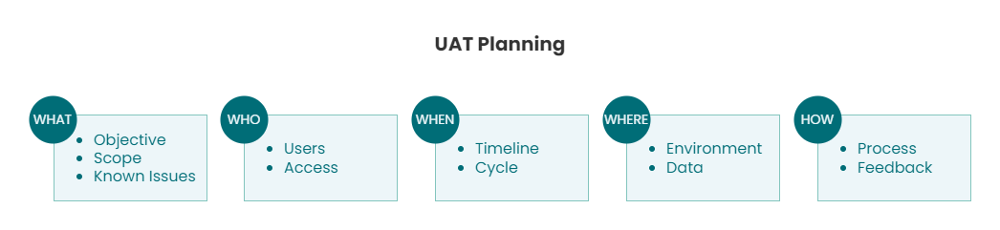

# Global Financial System Migration - UAT Project

- [Global Financial System Migration - UAT Project](#global-financial-system-migration---uat-project)
  - [Disclaimer](#disclaimer)
  - [Project Overview](#project-overview)
    - [High Level Overview Financial System Migration](#high-level-overview-financial-system-migration)
  - [Project Scope](#project-scope)
  - [Objective](#objective)
  - [Key Responsibilities](#key-responsibilities)
  - [Skills, Tools and Technologies](#skills-tools-and-technologies)
  - [Financial System Diagrams Process Flow](#financial-system-diagrams-process-flow)
    - [Legacy System - Hyperion Financial Management (HFM) Consolidation Process Flow](#legacy-system---hyperion-financial-management-hfm-consolidation-process-flow)
    - [New System - OneStream XF Process Flow](#new-system---onestream-xf-process-flow)
  - [Project Phases - Process](#project-phases---process)
    - [UAT Timeline](#uat-timeline)
  - [High Level Overview Flow UAT](#high-level-overview-flow-uat)
    - [UAT Process Flow](#uat-process-flow)
    - [Data Validation Framework](#data-validation-framework)
  - [Challenges and Solutions](#challenges-and-solutions)
  - [Key Achievements and Results](#key-achievements-and-results)

## Disclaimer 

This documentation is based on my personal experience and recollection of the project. It does not contain any proprietary information, actual data, or client-specific details. The purpose is to demonstrate the processes, experiences and lessons learned from managing a complex, multi-country UAT project.

## Project Overview 

- As a **lead consultant** from Genpact, I played a pivotal role in a comprehensive financial system migration project for a **Fortune 500** multinational corporation in the Fast-Moving Consumer Goods **(FMCG) sector**. 
  
- The project focused on **migrating the client's legacy Hyperion Financial Management (HFM) system to OneStream XF**, a cutting-edge platform for financial consolidation, reporting, planning, budgeting, and forecasting.

- This large-scale global project encompassed all regions including APAC, EMEA, and Americas, with approximately 20 countries in the APAC region alone, impacting financial operations across the entire organization.

- Our intensive involvement during the crucial 2.5-month period covering UAT, Training, and Go-Live phases.

- Key aspects of the project included:
  - Directly **managed and led User Acceptance Testing (UAT)** efforts for **5 key countries** in the **APAC** region, verifying that financial data in **OneStream reconciled and aligned with SAP** for over **80 critical reports**.
  - Facilitated the transition of core financial processes including month-end close, consolidation, and reporting.
  - Spearheaded key project phases including Testing and Validation, Training and Documentation, and Go-Live, with a focus on ensuring data accuracy and facilitating a seamless transition.
  - Ensured accuracy across a wide range of financial statements including P&L, Balance Sheet, Cash Flow Statements, Statement of Changes in Equity, Intercompany Accounting, Fixed Assets, and other key financial reports.

### High Level Overview Financial System Migration

  
  

  
  _Image by Author_

## Project Scope 

- **Client:** Fortune 500 multinational corporation in the FMCG sector (one of the world's largest companies in its specialized product category)
- **Duration:** ~Approximately 2.5 months (Jan 2022 to Mar 2022)
- **Region-Countries:** APAC (5 Countries)
- **Reports Tested**: 80+ key financial reports
- **Systems:** SAP (source) and OneStream (target)

## Objective 

- Ensure data integrity by validating the accuracy and consistency of financial data post-migration across systems between SAP to OneStream. 
- Identified and resolved data discrepancies, ensuring 100% accuracy in migrated financial data.
- Develop comprehensive training programs and documentation to ensure the team can effectively use the new system, targeting a 95% user proficiency rate within two months of go-live.

## Key Responsibilities 

To ensure the successful delivery of objectives, met the client's strategic goal for large-scale financial transformations:

- Oversaw UAT processes for complex reporting requirements in designated APAC countries.
- Led the team in executing standardized test cases, adapting them to local requirements (if any), and documenting issues across assigned countries.
- Conducted UAT for over 80 reports across 5 APAC countries, validating financial data (P&L, Balance Sheet, Intercompany, Inventory, Fixed Assets, etc.) between SAP and OneStream.
- Collaborated with **local and regional finance teams** to ensure a seamless transition, identifying and resolving discrepancies.
- Provided weekly updates on UAT testing status, discrepancies, and resolutions during stakeholder calls with the **Global Finance Team** and Project Lead.
- Escalated unresolved issues requiring assistance from the OneStream technical project team.

## Skills, Tools and Technologies 
- UAT Testing
- Financial Data Validation
- Stakeholder Communication (APAC Teams, Global Directors, Project Leads)
- **Financial Systems**: SAP, OneStream XF & Excel Quick View, Oracle Hyperion Financial Management (HFM) & Excel SmartView Reporting
- **Collaboration Tools**: Microsoft Teams, Excel
- **Project Management**: Jira, Excel (for test cases and reporting)
- **Reporting**: Excel Power Pivot

## Financial System Diagrams Process Flow

### Legacy System - Hyperion Financial Management (HFM) Consolidation Process Flow

### New System - OneStream XF Process Flow

_Image by Author_

## Project Phases - Process 

### UAT Timeline

_Image by Author_

1. **Requirement Gathering:**
     - Collaborated with local, regional and global finance teams to determined which modules, processes, and reports will undergo UAT - focusing on critical financial areas such as consolidation, reporting, reconciliations, budgeting, and forecasting.
     - Outline the UAT strategy, timelines, resources, and criteria for success
2. **Test Case Design:** 
   - Developed comprehensive test cases for each country, focusing on validating critical financial data across SAP and OneStream XF.
   - Ensured coverage of various reporting periods and financial scenarios, including standard and edge cases.
   - Designed tests to validate complex financial processes such as month-end, quarter-end, and year-end closings.
3. **Data Validation and Testing:**   
   - Ensured that OneStream XF is correctly integrated with SAP, enabling seamless data flow and meet business requirements.
   - Oversaw the validation of complex calculations, including currency conversions and intercompany eliminations.
   - Executed comprehensive financial processes, such as month-end close, budget revisions, and financial reporting.
   - Evaluated system behavior under peak loads to ensure reliability.
4. **Issue Tracking and Resolution:** 
     - Implemented a structured approach to identify, document, and resolve discrepancies
     - Determine whether issues stem from data mapping errors, integration glitches, or configuration settings.
     - Managed the resolution process, working closely with technical teams to implement fixes.
     - Conducted retesting to verify the effectiveness of implemented solutions.
     - Maintained a detailed log of all issues, their resolutions, and any system or process changes made. Classify issues based on severity and impact on financial processes.
5. **Progress Reporting and Stakeholder Communication:** 
   - Provided regular updates to global teams during weekly meetings.
   - Managed stakeholder expectations by communicating project risks, issues, and mitigation strategies.
   - Ensured adherence to project timelines while maintaining focus on financial reporting accuracy.
6. **User Training and Documentation:** 
   - Preparing end-users for the new system and ensuring they have the necessary resources to operate effectively post-implementation.
   - Conducted hands-on training sessions, covering system navigation OneStream XF, data input, executing financial processes and report generation.
   - Created user manuals and quick reference guides for common tasks and processes
7. **Go-Live and Post-Implementation Support:**
   - Monitored system performance and data integrity closely during during the initial operational phase to ensure smooth operations.
   - Facilitated the resolution of post-implementation issues and user queries.
8. **Lesson Learned**
   - Contributed insights to enhance future system migrations and financial process improvements.

## High Level Overview Flow UAT

### UAT Process Flow

### Data Validation Framework

_Image by Author_

- [`/test-case-examples`](1-test-cases-reports/1-sample-test-case-profit-and-loss.md): Sanitized examples of test cases

- [`/reconciliation-process`](2-reports/1-recons-report-template.md): General reconciliation methodology

- [`/issue-management`](2-reports/2-issue-tracking-template.md): Approach to issue tracking and resolution

## Challenges and Solutions 

**Challenge:** Countries with local accounting differences caused data mismatches during UAT
- **Solution:** Coordinated with country finance teams to adjust validation criteria and standardize data formats, reducing errors by 95%.

**Challenge:** Tight deadlines for month-end reporting during UAT testing.
* **Solution:** Implemented an automated Excel template to quickly identify discrepancies, allowing for faster resolution and on-time reporting.

**Challenge:** Chart of Account mapping issues
* **Solution:** Conducted thorough reviews with regional finance teams to ensure accuracy, and implemented a validation process to catch any remaining discrepancies. This reduced mapping errors by 98% and significantly accelerated the reconciliation process.

  
## Key Achievements and Results 

🔎 Read **Impact Report** at [here](4-results/impact-report.md).

 

[🔼 Back to top](#global-financial-system-migration---uat-project)

